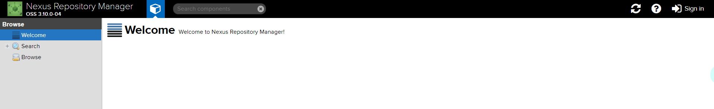
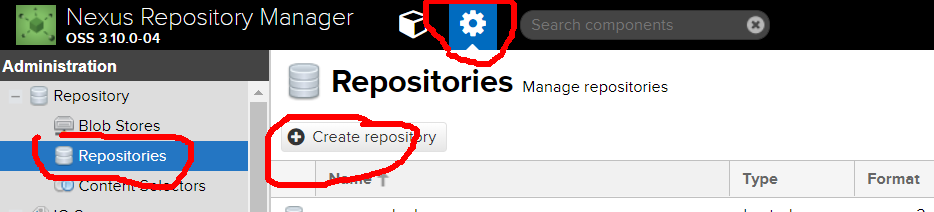
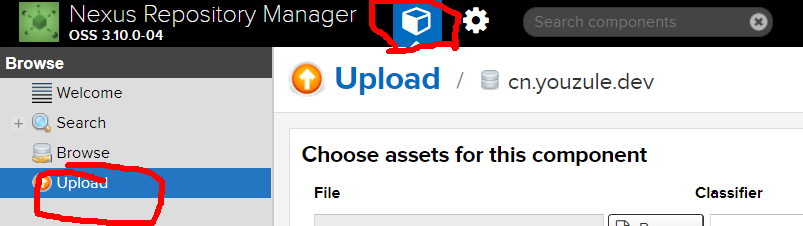

####maven使用nexus在linux上搭建私服

#####1 下载nexus
>[官网](https://help.sonatype.com/repomanager3/download)找到对应的nexus版本

    wget https://download.sonatype.com/nexus/3/latest-unix.tar.gz
    tar -zxvf latest-unix.tar.gz

#####2 启动
>修改配置文件，更改端口号(**按需要修改**)

    cd nexus-3.10.0-04/
    cd etc/
    vim nexus-default.properties
    application-port=8086 //修改 

>启动

    cd ../bin/
    ./nexus start

#####3 新建仓库
>登陆

在浏览器中访问：http://ip:8086，可以看到如下页面

使用默认密码登陆 admin  admin123

>按照如图所示，新建仓库

>上传jar包

#####4 下载依赖
>修改maven配置文件settings.xml

    <server>
            <id>cn.youzule.demo</id><!--仓库id,与pom.xml文件中distributionManagement中id对应-->
            <username>admin</username>
            <password>admin123</password>
    </server>

>修改pom.xml文件

    <repositories>
        <repository>
            <id>nexus</id>
            <name>nexus for gmdev</name>
            <url>http://ip:8086/nexus/content/groups/public/</url><!--仓库url,可直接从仓库复制-->
            <layout>default</layout>
            <snapshots>
                <enabled>true</enabled>
                <updatePolicy>always</updatePolicy>
            </snapshots>
        </repository>
    </repositories>
    <distributionManagement>
        <repository>
            <id>cn.youzule.demo</id>
            <name>releases</name>
           <url>http://ip:8086/nexus/content/groups/public/</url><!--仓库url,可直接从仓库复制-->
        </repository>
    </distributionManagement>

OK!如有问题，欢迎讨论。

